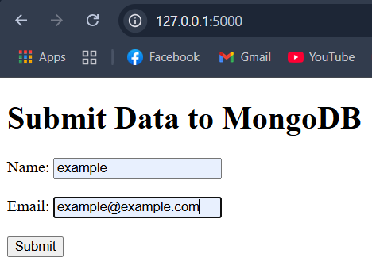
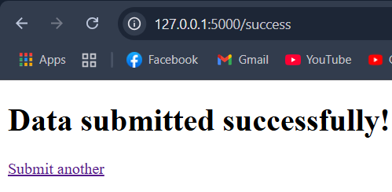

# MongoDB-Flask Contact Form

A simple web application that collects form submissions and stores them in MongoDB Atlas, with an API endpoint to view sample data.






## Features

- User-friendly contact form
- Data persistence in MongoDB Atlas
- JSON API endpoint
- Error handling and success notifications
- Responsive design

## How It Works

1. Users fill out the form with their name and email
2. The Flask backend validates and stores data in MongoDB
3. Successful submissions redirect to a confirmation page
4. The `/api` endpoint provides sample data in JSON format

## Setup Instructions

### Prerequisites
- Python 3.10+
- MongoDB Atlas account
- Git (optional)

### Installation
1. Clone the repository:
```bash
git clone https://github.com/yourusername/mongodb-flask-app.git
cd mongodb-flask-app
